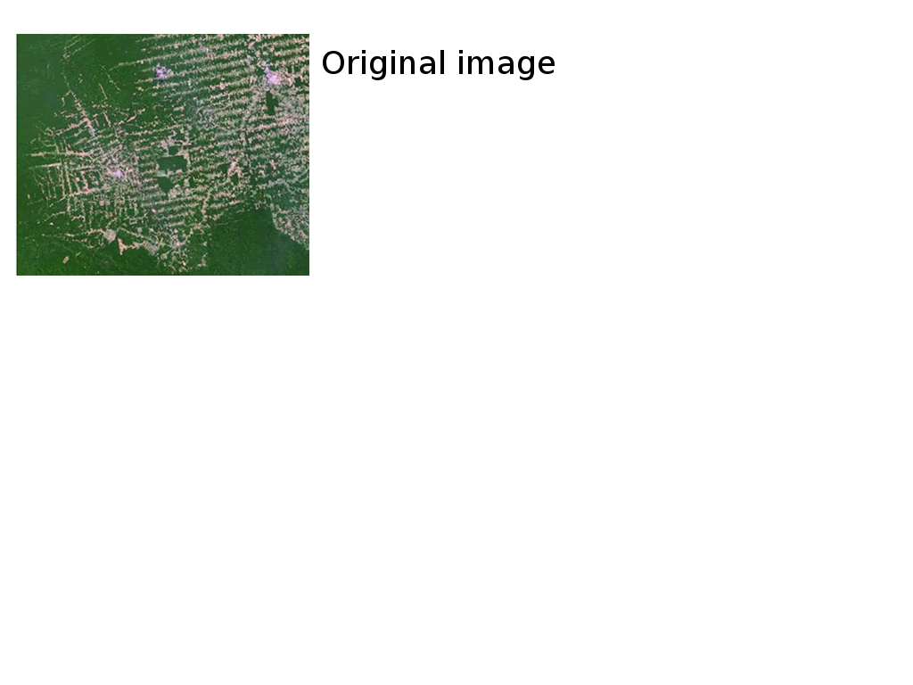

## Outline

> * What is GEE and how it works
> * Explore GEE API (__Javascript__ and ~~Python~~)
> * DSM workflow (with examples)
 * Compile covariates
 * Extract data from covariates
 * Model training
 * Generate map
 * Export

--- .segue .dark .nobackground

## Google Earth Engine

--- .nobackground

---

## Features

* Access to over 40 years of Satellite Imagery (with daily updates)
* Algorithms to analyse that data
* Google's computer clusters to analyse the data at scale
* A web-based tool for interactive data exploration

--- .segue .dark .nobackground

## How does it work?

--- bg:#FFF .nobackground

--- bg:#FFF .nobackground

--- bg:#FFF .nobackground

--- bg:#FFF .nobackground

--- bg:#FFF .nobackground

--- bg:#FFF .nobackground

--- bg:#FFF .nobackground

--- bg:#FFF .nobackground

---

## Features

* Access to over 40 years of Satellite Imagery (with daily updates)
* Algorithms to analyse that data
* Google's computer clusters to analyse the data at scale
* A [web-based tool](https://code.earthengine.google.com/) for interactive data exploration

--- .segue .dark .nobackground

## DSM workflow

---

## Compile covariates

\> 200 public datasets  
\> 4000 new images every day  
\> 5 million images  
\> 5 petabytes of data

---

## Examples

[Image and Image Collection](https://code.earthengine.google.com/97a8ece1d4ea58db05d5317e1e55ea80?noload=1)

[Basic calculations](https://code.earthengine.google.com/141d968b0b815625f1003ea215c3ef4f?noload=1)

---

## Extract data from covariates

* At the moment only using Fusion Tables
* Another alternative is using GeoJSON (usually for small datasets)
* Limit of 500,000 rows (also a size limit)

We will be using data [SOC from Edgeroi](assets/data/edgeroi_WGS84.csv)

# Let's import data into 

---

## Examples

[Feature Collection](https://code.earthengine.google.com/a970ea5bff3005119947380000a53112?noload=1)

[Extract covariates](https://code.earthengine.google.com/1ad8188d7f26cb631993de0548dd202b?noload=1)

---

## Model training

* Classification and Regression algorithms
* Limited number of algorithms available
  * Tree-like (CART, Random Forest)
  * Perceptron
  * Support Vector Machine
  * Others
* Alternative to use expressions (tree-like structures, linear models)

---

## Examples

[Train model](https://code.earthengine.google.com/b0f1030f127383b797e995b92b4d3515?noload=1)

---

## Generate map

This is the step where we can get most speed gain

* The predicion is made at the viewport
  * It depends on the extent
  * It depends on the zoom level (resolution)

It's not always necessary to view the prediction (lazy evaluation)

---

## Examples

[Apply model](https://code.earthengine.google.com/f06a57cc8638d542385e510182a0c811?noload=1)

---

## Export

There are multiple alternatives:

It is also possible to export images as Assets

---

## Examples

[Export](https://code.earthengine.google.com/bf3a7ba541cf8c07cccbe2806fa80af5?noload=1)
